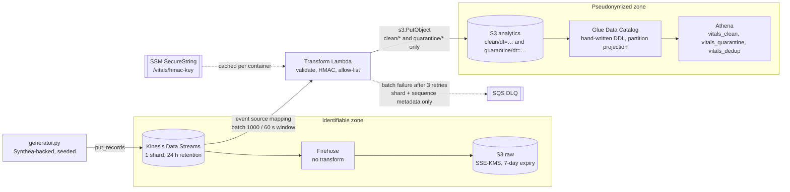

# Real-Time Patient Vitals Ingestion & Pseudonymization Pipeline

A streaming data pipeline on AWS that ingests synthetic patient vital signs, validates them, replaces patient identifiers with keyed pseudonyms, and makes the result queryable in Athena. 


> **Scope.** One weekend project. All data is synthetic (generated with [Synthea](https://github.com/synthetichealth/synthea)). Output is **pseudonymized**.

---

## Contents

- [Architecture](#architecture)
- [Design decisions](#design-decisions)
- [Data contract](#data-contract)
- [Data quality rules](#data-quality-rules)
- [Pseudonymization statement](#pseudonymization-statement)
- [Sample input and output](#sample-input-and-output)
- [Verification results](#verification-results)
- [Repository layout](#repository-layout)
- [Running it](#running-it)
- [Cost notes](#cost-notes)
- [Limitations and next steps](#limitations-and-next-steps)
- [Teardown](#teardown)

---

## Architecture



| Component | Resource | Key settings |
|---|---|---|
| Stream | `AWS::Kinesis::Stream` | `PROVISIONED`, 1 shard, 24 h retention |
| Transform | `AWS::Serverless::Function` | Python 3.12, 256 MB, 60 s; Kinesis trigger `TRIM_HORIZON`, batch 1000, 60 s window, 3 retries, no bisect |
| Dead-letter queue | `AWS::SQS::Queue` | SSE-SQS, 14-day retention; receives batch metadata only |
| Raw backup | `AWS::KinesisFirehose::DeliveryStream` | Kinesis source, no transform, GZIP, `raw/dt=YYYY-MM-DD/` |
| Raw bucket | `AWS::S3::Bucket` | SSE-KMS (`aws/s3`), 7-day expiration, public access blocked |
| Analytics bucket | `AWS::S3::Bucket` | SSE-S3; writable only by the transform, only under `clean/*` and `quarantine/*` |
| Catalog | `AWS::Glue::Table` ×2 | OpenX JSON SerDe, `dt` partition projection from `2026-09-01` |
| Query | `AWS::Athena::WorkGroup` | `vitals-wg`, configuration enforced, SSE-S3 results |
| Alarm | `AWS::CloudWatch::Alarm` | Lambda `Errors > 0` over 5 min |

Everything is deployed with AWS SAM from a single `template.yaml`, except the HMAC key, which is created out-of-band because CloudFormation cannot create SecureString parameters.

---

## Design decisions

**Why pseudonymize rather than de-identify?**
When thinking of this project I viewed the end result from an analytics use case - one that requires longitudinal analysis. Because of that, events from the same patient need to remain linkable. To do this, patient identity can't be removed entirely, or else the analyst won't be able to group a patient's events.

**Why application-level HMAC instead of an AWS entity-resolution service?**
For this project, the data pipeline receives a synthetic patient identifier, so entity matching isn't necessary. Using an  HMAC key makes the created pseudonyms deterministic while still allowing events for the same patient to be joinable. Writing custom logic in the transform Lambda keeps the pseudonymization boundary explicit and allows the pipeline to guarantee that identifiers are removed before any analytics data is written.

**Transformation in front of the analytics write** 
My initial design had the Lambda transform occur after data arrived in Firehose. However, Firehose writes the *original source record* to an `errors/` prefix in the destination bucket whenever a transform invocation fails (due to timeout, throttling, out-of-memory, or service errors), with no way of preventing that from inside the transform. Instead, I decided to put the Lambda transform in front and let it write pseudonymized objects itself, avoiding the situation of any PII from reaching the analytics bucket due to infrastructure failures. This setup relegates Firehose to only copying raw records to S3. This is enforced via Firehose's role, which has no permissions on the analytics bucket, and with a contract test.

**HMAC-SHA256**
Because patient IDs come from a small overall space, a plain SHA256 hash could be reversed by enumeration. `patient_key` is an HMAC with a 256-bit key held in an SSM SecureString and cached per Lambda container.

**Contract schema with enforced syncs**
`src/core/schema.py` is the single source of truth for fields, valid ranges, identifier fields, partition constants, and output columns. The generator and transform import it and check for drift at their startups. The Glue column lists and the dedup view are the only places were the schema is hand-maintained, and tests will catch if either drifts.

**Batch writes** 
Writing is not 'per event', since it would be much more efficient to do them in batches of up to 1,000 records or 60 seconds. The transform Lambda writes one gzipped JSON-lines object per zone and date per batch.

**Idempotent retries** 
Object keys are `{zone}/dt={dt}/{shardId}-{firstSequence}.json.gz`, deterministic per batch, so a batch retry will overwrite its own objects.

**Quarantine** 
Invalid records are written to `quarantine/` with a given reason and an identifier-stripped payload. I wanted them to be easily queryable for inspection, reconciliation, and downstream analysis.

**Event time over arrival time** 
Records are partitioned by event date so late events land where they belong, falling back to arrival date when the timestamp is unusable. Partition projection replaces a crawler, so new partitions are queryable immediately.

**Timestamps stored as strings** 
The OpenX JSON SerDe is unreliable with ISO 8601 timestamps, so values are written in a fixed-width UTC format (`2026-09-28T18:11:01.784Z`). This way, Lexical order == Chronological order.

**Dedup at query time**
Kinesis delivery is 'at-least-once', so there had to be a plan for dealing with duplicate records (generator will inject duplicates). Thus, the `vitals_dedup` view was created, keeping only the first row per `event_id` by ingestion time.

**Abnormal is not always invalid**
With human health metrics, valid ranges correspond with physiologically *possible* bounds. There can, and will, be abnormal readings that still should be considered, i.e a heart rate of 145 vs −5, first is plausible while the second is a data error.

**Reproducibility** 
I used seeded random generation and sorted rows before sampling in the name of reproducibility.

---

## Data quality rules

**Vitals.**

| Vital | LOINC | Unit (UCUM) | Type | Valid range (inclusive) |
|---|---|---|---|---|
| `heart_rate` | 8867-4 | `/min` | int | 20–300 |
| `systolic` | 8480-6 | `mm[Hg]` | int | 50–300 |
| `diastolic` | 8462-4 | `mm[Hg]` | int | 20–200 |
| `spo2` | 59408-5 | `%` | double | 50–100 |
| `temperature_c` | 8310-5 | `Cel` | double | 30–45 |

**Quarantine reasons**

| Reason | Trigger |
|---|---|
| `unparseable` | Not valid JSON, or not a JSON object. Payload is empty. |
| `missing_required_field` | A required field is absent/null |
| `invalid_type` | A required field is not a non-empty string; a vital is a boolean; an integer vital is a float; a vital is not numeric |
| `invalid_timestamp` | `event_timestamp` does not parse, or has no UTC offset |
| `out_of_range` | A vital falls outside of its valid range |
| `processing_error` | Unexpected exception. Payload is empty. |

**Injected errors**

| Injected error | Default rate | Expected zone |
|---|---|---|
| `missing_value` | 3% | clean |
| `out_of_range` | 2% | quarantine |
| `missing_patient_id` | 1% | quarantine |
| `duplicate` | 2% | clean |
| `late_event` | 2% | clean (backdated 1–6 h, partitioned by event date) |

---

## Theoretical HIPAA compliance

The analytics bucket contains only pseudonymized output. Write access is limited by IAM to the transform function's `clean/` and `quarantine/` prefixes. Raw records, which carry PII (names, birth dates, SSNs, MRNs, device IDs), exist only in the Kinesis stream (24 hour lifecycle) and the KMS-encrypted raw bucket (7 day lifecycle).

### Safe Harbor Limits
- Output is **pseudonymized**, not de-identified.
- Full event timestamps are kept, not stripped of all specifics past the year.

---

## Sample input and output

**Input event.**

```json
{
  "event_id": "EVT-000002",
  "patient_id": "<synthea-patient-uuid>",
  "event_timestamp": "2026-09-28T18:11:01.784Z",
  "first_name": "<synthetic>",
  "last_name": "<synthetic>",
  "birth_date": "<synthetic>",
  "ssn": "<synthetic>",
  "mrn": "MRN-100002",
  "device_id": "DEV-0002",
  "heart_rate": 75,
  "systolic": 109,
  "diastolic": 76,
  "spo2": 94.1,
  "temperature_c": 37.0
}
```

**Clean output**

```json
{
  "event_id": "EVT-000002",
  "patient_key": "3f6bdae6d773af25cb63095ba4060c98a4ea7e3b9aedf06b03f311cab46de12a",
  "event_timestamp": "2026-09-28T18:11:01.784Z",
  "ingest_ts": "2026-09-28T18:11:53.698Z",
  "heart_rate": 75,
  "systolic": 109,
  "diastolic": 76,
  "spo2": 94.1,
  "temperature_c": 37.0
}
```

**Quarantine output** for an injected out-of-range value (`EVT-000036`, `systolic=47`). The payload is abbreviated. The bad value is kept for debugging, replacing `patient_id` with `patient_key` and dropping every identifier.

```json
{
  "event_id": "EVT-000036",
  "reason": "out_of_range",
  "payload": "{\"event_id\": \"EVT-000036\", \"event_timestamp\": \"…\", \"patient_key\": \"…\", \"heart_rate\": …, \"systolic\": 47, \"diastolic\": …, \"spo2\": …, \"temperature_c\": …}"
}
```

---

## Verification results

Full run: seed 20, 100 patients, 10,000 distinct events, 10,194 records sent.

| Check | Expected | Result |
|---|---|---|
| Distinct quarantined `event_id` | 316 (exact) | ✓ matched |
| Quarantine reasons | `out_of_range` 227, `missing_required_field` 89, nothing else | ✓ matched |
| Quarantine set vs `ground_truth.jsonl` | empty diff | ✓ empty |
| Clean rows | ≥ 9,878 | ✓ |
| Distinct clean `event_id` | 9,684 (exact) | ✓ matched |
| `vitals_dedup` rows / duplicate `event_id`s in view | 9,684 / 0 | ✓ matched |
| Identifier patterns in any analytics object (`MRN-`, `DEV-`, SSN format, identifier field names) | 0 | ✓ 0 |
| Identifier patterns in Lambda logs | 0 | ✓ 0 |
| DLQ `ApproximateNumberOfMessages` | 0 | ✓ 0 |
| `errors/` prefix in analytics bucket | absent | ✓ absent |


---

## Running

### Prerequisites

- Python 3.11+
- AWS CLI v2 and AWS SAM CLI, configured for your account and region.
- A Synthea run with at least 100 living patients at `synthea/output/csv/patients.csv`.

### 1. Test locally

```bash
python3 -m pytest -q
```

### 2. Create the HMAC key

```bash
REGION=$(aws configure get region)        # has to match the region you will deploy to
aws ssm put-parameter --region "$REGION" --name /vitals/hmac-key \
  --type SecureString --tier Standard \
  --description "HMAC-SHA256 key for vitals patient_key pseudonyms" \
  --value "$(openssl rand -hex 32)"

# verify without decrypting
aws ssm get-parameter --region "$REGION" --name /vitals/hmac-key \
  --query 'Parameter.[Name,Type,Version]' --output text
```

#### NOTE: Key rotation produces new `patient_key` values, breaking joins across the change.


### 3. Deploy

```bash
sam build
sam deploy --guided --stack-name vitals-pipeline
```


### 4. Full run

```bash
aws s3 rm "s3://<AnalyticsBucketName>/" --recursive
PYTHONPATH=src python3 generator/generator.py --mode kinesis --stream-name "$STREAM"
```

---


## Future additions

- S3 access audits via CloudTrail S3 data events on the raw bucket
- Add a notification to the alarm (SNS topic with an email subscription)
- Schema registry or evolution strategy (Glue Schema Registry)
- CD roles for Sam